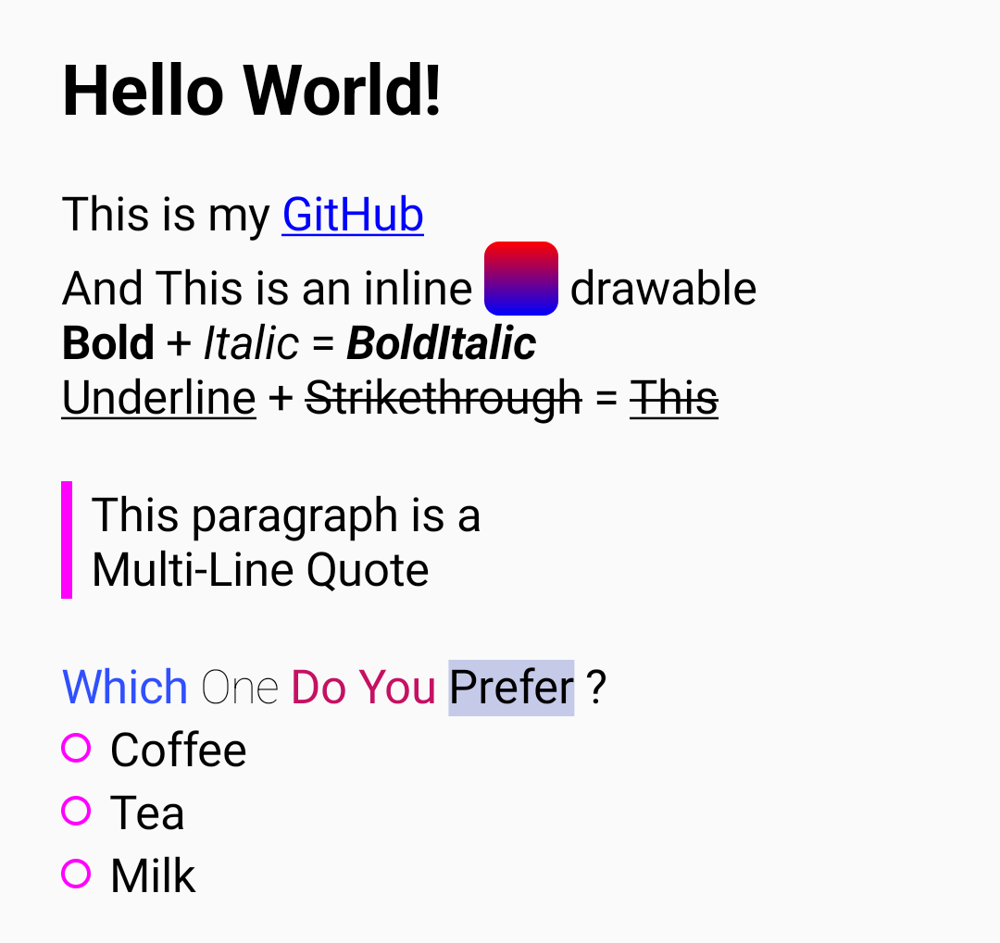
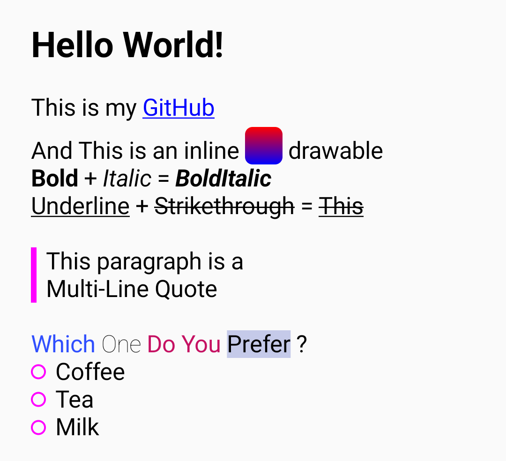

# AnnotatedText
[](http://developer.android.com/index.html)
[](https://android-arsenal.com/api?level=21)
[](https://search.maven.org/artifact/io.github.aghajari/AnnotatedText/1.0.3/aar)
[](https://gitter.im/Aghajari/community?utm_source=badge&utm_medium=badge&utm_campaign=pr-badge&utm_content=badge)

 A Jetpack Compose library to fully convert Android's [Spanned](https://developer.android.com/reference/android/text/Spanned) into [AnnotatedString](https://developer.android.com/reference/kotlin/androidx/compose/ui/text/AnnotatedString).

 You can use this library to display [Html.fromHtml(String)](https://developer.android.com/reference/android/text/Html) on Compose [Text](https://developer.android.com/jetpack/compose/text), <br>
 Exactly similar to what was previously displayed on Android [TextView](https://developer.android.com/reference/android/widget/TextView).

 **Compose Text**   Vs   **Android TextView**<br>
 

## Supported Spans
**AnnotatedText** supports all default android spans both [CharacterStyle](https://developer.android.com/reference/android/text/style/CharacterStyle) and [ParagraphStyle](https://developer.android.com/reference/android/text/style/ParagraphStyle) spans.

**CharacterStyle** spans:
 - URLSpan
 - ImageSpan
 - AbsoluteSizeSpan
 - RelativeSizeSpan
 - BackgroundColorSpan
 - ForegroundColorSpan
 - StrikethroughSpan
 - UnderlineSpan
 - StyleSpan
 - SubscriptSpan
 - SuperscriptSpan
 - ScaleXSpan
 - SkewXSpan
 - LocaleSpan
 - TextAppearanceSpan
 - TypefaceSpan

**ParagraphStyle** spans:
 - QuoteSpan
 - BulletSpan
 - IconMarginSpan
 - DrawableMarginSpan
 - LeadingMarginSpan.Standard
 - AlignmentSpan (v1.0.4)
 - LineBackgroundSpan (v1.0.4)
 - LineHeightSpan (v1.0.4)

## Installation

**AnnotatedText** is available in `mavenCentral()`

Gradle
```gradle
implementation 'io.github.aghajari:AnnotatedText:1.0.3'
```

Maven
```xml
<dependency>
  <groupId>io.github.aghajari</groupId>
  <artifactId>AnnotatedText</artifactId>
  <version>1.0.3</version>
  <type>pom</type>
</dependency>
```

## Usage

### Spanned asAnnotatedString
```kotlin
val spanned = buildSpannedString {
    append("Hello ")
    inSpans(UnderlineSpan()) {
        append("World!")
    }
}

AnnotatedText(
    text = spanned.asAnnotatedString(),
    ...
)
```

### From HTML
```kotlin
AnnotatedText(
    text = "Hello <b>World!</b>".fromHtml(),
    ...
)
```

### URL onClick
```kotlin
AnnotatedText(
    text = "Link to <a href='https://github.com'>GitHub</b>".fromHtml(linkColor = Color.Blue),
    onURLClick = { url ->
        println(url)
    }
)
```

### Custom SpanMapper


```kotlin
val content = remember {
    "Welcome to my <a href='https://github.com/Aghajari'>GitHub</a>".fromHtml(
        spanMappers = mapOf(
            URLSpan::class to {
                linkColor = Color.Red
                textDecoration = TextDecoration.LineThrough
            }
        )
    )
}

AnnotatedText(
    text = content,
    ...
)
```

### Default Compose Text + Modifier
```kotlin
val content = remember {
    "<blockquote>Hello <b>World!</b></blockquote>".fromHtml()
}
val layoutResult = remember {
    mutableStateOf<TextLayoutResult?>(null)
}

Text(
    text = content.annotatedString,
    inlineContent = content.getInlineContentMap(),
    onTextLayout = { layoutResult.value = it },
    modifier = Modifier
        .annotatedTextParagraphContents(content, layoutResult)
        .annotatedTextClickable(content, layoutResult) { url ->
            println(url)
        }
)
```

## Author
Amir Hossein Aghajari

License
=======

    Copyright 2023 Amir Hossein Aghajari
    Licensed under the Apache License, Version 2.0 (the "License");
    you may not use this file except in compliance with the License.
    You may obtain a copy of the License at

       http://www.apache.org/licenses/LICENSE-2.0

    Unless required by applicable law or agreed to in writing, software
    distributed under the License is distributed on an "AS IS" BASIS,
    WITHOUT WARRANTIES OR CONDITIONS OF ANY KIND, either express or implied.
    See the License for the specific language governing permissions and
    limitations under the License.

<br>
<div align="center">
  
  <br><a>Amir Hossein Aghajari</a> • <a href="mailto:amirhossein.aghajari.82@gmail.com">Email</a> • <a href="https://github.com/Aghajari">GitHub</a>
</div>
